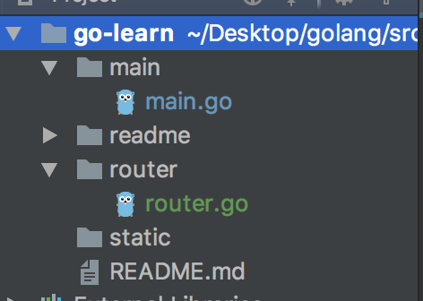
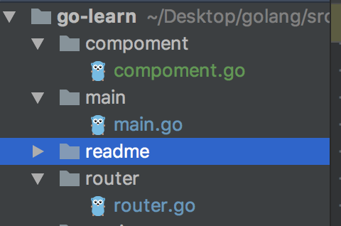
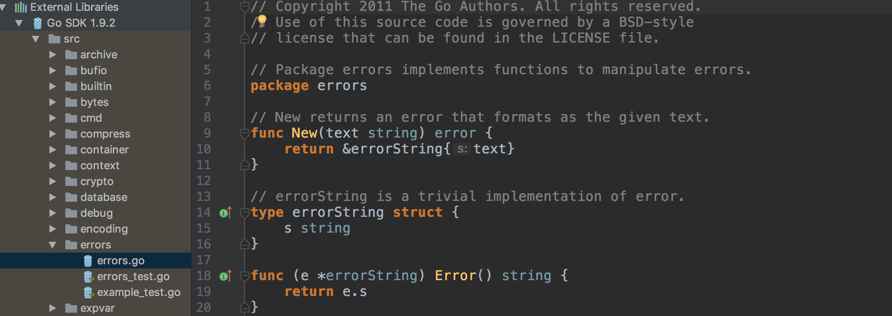
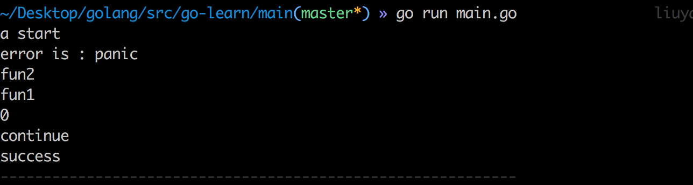
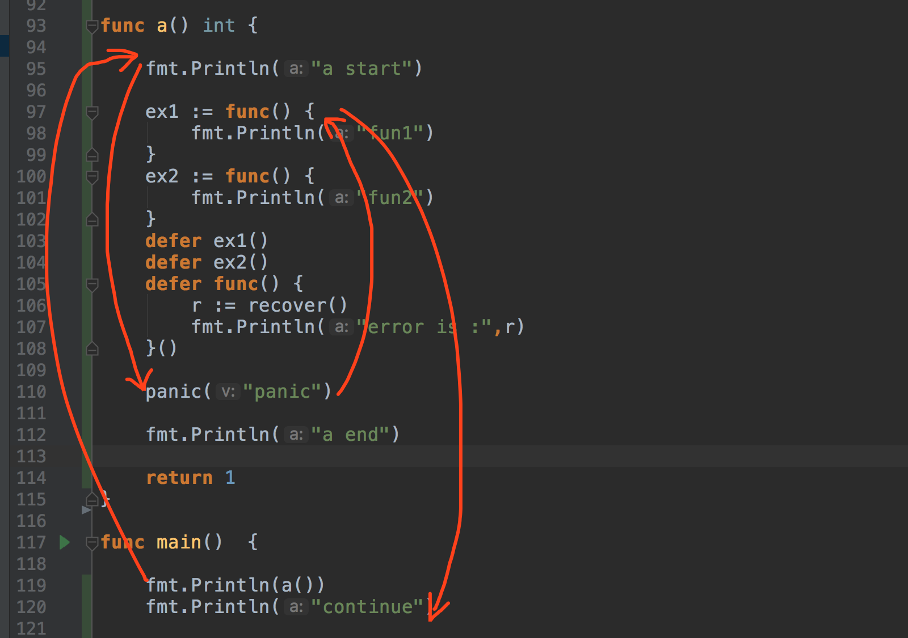

## 目录


- [简介、编译、运行](#简介)

- [变量](#变量)

- [函数](#函数)

- [结构体](#结构体)

- [嵌入类型](#嵌入类型)

- [数组](#数组)

- [切片](#切片)

- [映射](#映射)

- [包](#包)

- [接口](#接口)

- [错误处理](#错误处理)

- [代码格式化](#代码格式化)

- [语句](#语句)

- [函数类型](#l函数类型)

- [协程、通道](#协程、通道)

### 简介


> go是一种编译型(编译速度快)、具有静态类型(静态类型意味着变量必须指定一个类型)和类c风格语法的语言，并具备垃圾回收机制。

> 它不是面向对象的语言，所以没有对象和继承的概念（使用组合来实现继承）。也没有多态和重载的特性


- 对于简单的例子，我们不需要深入到go的工作目录中

- 在go语言中，程序的入口是main包中的main函数

- go程序运行命令

```go

go run main.go

```

- 编译

go run会先编译然后再运行你的代码，它会在一个临时的目录下编译这段代码，然后执行，最后自动清除生成的临时文件。
通过运行以下命令你可以看见这个零临时文件的位置：

```go
go run --work main.go

```

- 打包，可执行文件

这会生成一个可执行文件main，你可以直接运行它。在linux/osx中，不要忘记在可执行文件前面加上点和反斜杠，所以你需要输入./main运行程序。

```go
go build main.go
```

- go有很多内置的函数，例如println，不需要引用即可使用。
- go在函数名前加了包名作为前缀，例如，fmt.Println。
- go在导入包的时候是比较严格的，如果导入的包没有被使用，那么程序不能被编译。(这就是为啥编译快的原因)


[go的标准库](https://golang.org/pkg/)


### 变量

1. `var NAME TYPE`声明一个变量，并且变量的初始值为它相应类型的零值，
1. 使用`NAME := VALUE`声明一个变量并赋值，
1. 使用`NAME = VALUE`去给已经声明过的变量赋值


- 一般赋值

```
//声明变量，默认整型为0，布尔型赋false，字符串型赋""等
var power int
//赋值
power = 9000

```

- 声明并赋值

```
var power int = 9000
```
- 简易写法
```
power := 9000
```
- 函数赋值
```
func main() {
    power := getPower()
}
func getPower() int {
    return 9001
}
```

> 在一个代码范围内变量只能被声明一次

- 错误的声明

```
func main() {
   power := 9000
   power := 9001
}

```


- 多变量赋值


```go
//go支持多个变量同时赋值（使用=或者:=）
name, power := "Goku", 9000

```
- 如果多个变量既存在新变量，也存在已声明的变量，也可以使用:=进行赋值

```
 power := 1000
 name, power := "Goku", 9000

```


> go程序中不能存在未使用的变量，


### 函数

- 声明函数

```go

//无返回值函数
func log(name string) {
}

- 一个返回值函数
func add(a int, b int) int {
}

- 多返回值函数
func power(name string) (string, bool) {
}
```

- 函数调用

```go

//普通调用
name, result := power("------")

//只接收某个值
_, result := power("------")

```

>`_`是一个空白标识符。（用于接收不想接收的值）


### 结构体


- 定义一个结构体

```
//结构体名称大写，成员名称大写（这样外部可访问）

type People struct {
	Name string
	Age int
}

```

- 声明和初始化

```go

tom := People{Name:"Tom",Age:16}

//简写
carl := People{"Carl",23}

//结尾的逗号,是不能省的。（不然报编译错误）
adam := People{
    Name:"Adam",
    Age:45,
}

//结构体的字段也会有一个0值。
Bob := People{}

```


> 在go语言中，函数的参数传递都是值传递(值引用)，即传递的是一个拷贝。

- 值引用

```
func copy1()  {
	adam := People{
		Name:"Adam",
		Age:16,
	}
	grow1(adam)
	fmt.Println(adam.Age) //输出16
}
// 值引用 或者说 值copy ，对原结构体的值没有影响
func grow1(people People)  {
	people.Age += 1
}

```

- 指针引用

```go
func copy2()  {
	adam := &People{
		Name:"Adam",
		Age:16,
	}
	grow2(adam)
	fmt.Println(adam.Age) //输出17
}
//也是指针的copy值，但是指向的都是同一个资源。
func grow2(people *People)  {
	people.Age += 1
}


```
> &叫取地址符

> People 是一个值类型

> *People 地址类型 指针类型

> 复制一个指针变量的开销比复制一个复杂的结构体小。在一个64的系统上，指针的大小只有64位。如果我们的结构体有很多字段，
创建一个结构体的拷贝会有很大的性能开销。指针的真正意义就是通过指针可以共享值,所以上面的指针引用很能节省开销。


#### 结构体方法

go里面的method和func的区别就是，方法有一个接收者

> A method is a function with a receiver

- 类型*People是super方法的接收者

```go
func (people *People) super()  {
	people.Age += 2
}

```

调用

```go

adam := &People{
		Name:"Adam",
		Age:16,
	}
adam.super()
fmt.Println(adam.Age) //输出18

```


#### 构造函数

结构体没有构造函数，不过可以通过函数来返回一个结构体实例

```go

func newPeople(name string,age int) *People  {
	return &People{
		Name:name,
		Age:age,
	}
}

func newPeople1(name string,age int) People  {
	return People{
		Name:name,
		Age:age,
	}
}

```

```go

fmt.Println(newPeople("Tom",26))  //输出 &{Tom 26}

fmt.Println(newPeople1("Tom",26)) //输出 {Tom 26}

```

尽管没有构造函数，go有一个内置的函数new，可以用来分配一个类型需要的内存。

```go

p1 := new(People)
//等同于 p1 := &People{}
p1.Age = 26
p1.Name = "Army"

fmt.Println(p1)  //输出 &{Army 26}

```

值类型和指针类型类型

```go

//p2 是值类型
p2 := People{Name:"xiaoming",Age:23}

//p1 是指针类型
p1 := new(People)

fmt.Println(p1)  //输出 &{Army 26}
fmt.Println(p2) //输出  {xiaoming 23}

```

#### 结构体成员

> 结构体成员可以是任意的类型，比如整型、字符串类型、布尔类型，以及数组、映射、接口和函数类型

比如我们给People扩展一下


```go

type People struct {
	Name string
	Age int
	Father *People
}

```
初始化

```go

peo := &People{
		Name : "Tom",
		Age : 20,
		Father:&People{
			Name:"Smith",
			Age:56,
		},
	}
fmt.Println(peo.Father)  //输出 &{Smith 56 <nil>}
```


### 嵌入类型


go语言没有继承的概念，但是提倡使用代码复用的方式，即组合。嵌入类型就是组合的一种方式。

>嵌入类型方便我们扩展或者修改已有的类型

> 结构体类型可以包含匿名或者嵌入字段。也叫做嵌入一个类型。当我们嵌入一个类型到结构体中时，该类型的名字充当了嵌入字段的字段名。

定义一个Person的结构体
```go
type Person struct {
	Name string
	Height int
}

//接收者为指针类型的方法
func (person *Person) GetName()  {
	fmt.Println("my name is",person.Name)
}
//接收者为值类型的方法
func (person Person) GetNameValue() {
	fmt.Println("my name is",person.Name)
}

```
定义一个User的结构体

```go

type User struct {
	phone string
}

//接收者为指针类型的方法
func (user *User) GetPhone()  {
	fmt.Println("user phone is",user.phone)
}
//接收者为值类型的方法
func (user User) GetPhoneValue() {
	fmt.Println("user phone is",user.phone)
}
```
扩展People

```go

type People struct {
	*Person  //嵌入指针类型
	User       //嵌入结构体类型

	Name string
	Age int
	Father *People
}

```

初始化一个值类型和指针类型的People
```go
//指针类型
p1 := &People{
    Person:&Person{"Tom",67},
    User:User{phone:"17789876543"},
    Name:"Army",
    Age:23,
    Father:&People{
        Name:"Smith",
        Age:56,
    },

}
//值类型
p2 := People{
    Person:&Person{"Alen",78},
    User:User{phone:"16698765432"},
    Name:"Adam",
    Age:26,
    Father:&People{
        Name:"Adan",
        Age:59,
    },
}

```
结果分析

```go

//我们可以通过访问访问嵌入类型间接访问嵌入类型的方法和成员
p1.Person.GetName()
p1.Person.GetNameValue()
p1.User.GetPhone()
p1.User.GetPhoneValue()
p2.Person.GetName()
p2.Person.GetNameValue()
p2.User.GetPhone()
p2.User.GetPhoneValue()
fmt.Println(p1.User.phone)
fmt.Println(p1.Person.Name)
fmt.Println(p2.User.phone)
fmt.Println(p2.Person.Name)

//go语言嵌入类型的方法提升
//指针类型和值类型的people可以直接访问嵌入类型的接收者为值类型或者指针类的方法和成员
p1.GetName()
p1.GetNameValue()
p1.GetPhone()
p1.GetPhoneValue()
p2.GetName()
p2.GetNameValue()
p2.GetPhone()
p2.GetPhoneValue()
fmt.Println(p1.phone)
fmt.Println(p2.phone)

//当people的成员字段名和嵌入类型的字段名冲突的时候，嵌入类型的字段名被覆盖。
fmt.Println(p2.Name) //输出p2的name，而不是p2的User的name
fmt.Println(p1.Name)


```


以上可看出 假设结构体类型P(*People 或者说外部类型)和嵌入类型B(*Person)

> P和&P可以直接访问B的接收者为值类型或者指针类型的方法和成员（类似继承）

> P和&P也可以通过访问嵌入类型来间接访问嵌入类型的方法和成员

> 外部类型可以设置和嵌入类型一样的成员字段名和方法名来覆盖嵌入类型 （类似重载）


### 数组


在go中，数组是固定大小的。则不可改变。不能访问超过数组边界的元素。

```go
//声明再赋值
var array [4]int
array[0] = 1
fmt.Println(array) //输出[1 0 0 0]
//直接初始化
array2 := [3]string{"a","b","c"}
fmt.Println(array2) //输出[a b c]
//遍历
for index,value := range array2 {
    fmt.Println(index,"--",value)
}

```


### 切片

切片是Go数组的一个抽象，或者说是Go数组的一个封装。切片比数组更加灵活好用。

#### 切片声明和创建

> 切片同数组一样不能访问超出切片范围的元素

1. 第一种，简单切片使用这种方式

```go
arrays := []string{"a","b"}

arrays[1] = "c"
fmt.Println(arrays)  //  [a c]
```
2. 第二种,在切片特定位置写入值很有用

```go
//定义一个长度和容量均为5的切片
pos := make([]int,5)
pos[1] = 3
pos[4] = 8
fmt.Println(pos)

```

3. 第三种，定义一个空切片，对于切片数量未知的时候使用
```go
var names []string
fmt.Println(names)

```

4. 第四种，可以指定切片的长度和容量。

```go
//定义一个长度为0容量为10的切片
users := make([]int,0,10)
fmt.Println(users)

```

####  添加元素、切片扩容

- `cap()`是一个内置函数，能计算切片的容量

```go
fmt.Println(cap(users)) //输出10
```

> 使用`append()`给切片添加元素，如果切片容量不够会自动扩容。go扩展数组使用的是2倍算法（2x algorithm）


```go
fmt.Println(users)  //输出 []
fmt.Println(cap(users)) //输出10

uc := cap(users)
for i:=0;i<25 ;i++  {
    users = append(users,5)
    if uc != cap(users) {
        fmt.Println("索引:",i,"; users容量:",cap(users))
        uc = cap(users)
    }
}

```


输出结果

```shell
[]
10
索引: 10 ; users容量: 20
索引: 20 ; users容量: 40
```
可以看出，users初始容量为10；
当使用`append()`给users添加第十一个元素的时候，users的容量变为20；
给users添加第21个元素的时候，users的容量变为40；


#### 子切片

在其他语言中如ruby、js中使用`slice`获取数组的切片。事实上是操作一个copy的全新的数组，不会对原切片造成影响。
而go语言不同的是操作使用`slice`获取的切片等同于操作原切片


```go
users := []int{1,2,3,4,5}
slice := users[2:5]
fmt.Println(slice)  //[3 4 5]
slice[1] = 10
fmt.Println(users)  //[1 2 3 10 5]

//等同于
users[2] = 10

```

#### 使用切片

- [a:b]获取切片索引a到索引b的切片
- [:b]获取切片开始到索引b的切片
- [a:]获取索引b到切片结束的切片

> `strings.Index()`获取字符串某个字符所在索引

> `len()`获取切片长度

如下例

```
str := "welcome to beijing"
str1 := strings.Index(str[5:], "o")
fmt.Println(str) // welcome to beijing
fmt.Println(str[5:]) // me to beijing
fmt.Println(str1) // 4

user := []int{1,2,3,4,5}
fmt.Println(user[:len(user)-1]) //  [1 2 3 4]
```

#### copy函数

获取其他切片元素按序填充到目的切片中。

如下例
```go
user := []int{1,2,3,4,5}
peo := make([]int,5)
copy(peo[2:3],user[0:3])
fmt.Println(peo) // [0 0 1 0 0]
```


### 映射

类似`key`,`value`

```go

//初始化一个映射，简易写法
mmp := map[int]string{
    2:"a",
    3:"b",
}
fmt.Println(mmp)  //输出  map[2:a 3:b]

//使用make初始化、创建，10代表容量，定义初始大小可提升性能
dic := make(map[string]string,10)

//赋值
dic["name"] = "xiaoming"
fmt.Println(dic)

//取值
//第一个参数代表对应的值，第二个代表是否存在
value,exists := dic["name"]
fmt.Println(value,exists) //  输出  xiaoming true

//获取映射键的个数
fmt.Println(len(dic))

//删除键为name的映射
//delete(dic,"name")

//遍历,无序的，每次输出顺序都是随机的
for key,value := range dic{
    fmt.Println(key,value)
}


```

### 包

> `$GOPATH`工作目录,运行`go env`可查看

- 项目位于$GOPATH/src/

创建一个新的文件夹router，在其下创建一个新的文件router.go

项目目录如下图




在router.go中写一个结构体和方法。

```
package router   //包名和文件夹名字一致

import "fmt"

type Router struct {
	Name string  //字段名要大写，不然外部无法调用
}
//方法名要大写，不然外部无法调用
func (router Router) GetName()  {
	fmt.Println(router.Name)
}

```
然后我们在main.go中引入

```go
import (
	"fmt"   //内置包导入
	"go-learn/router"  //自定义包导入，需写全路径
)

```
方法调用

```go
rou := router.Router{Name:"polly"}
fmt.Println(rou) // {polly}
rou.GetName() // polly

```

#### 循环导入

循环导入即A中引入了B包，B中又引入了A包。导致编译器报编译错误。

如下，扩展router.go文件，增加一个函数PrintName()，并且在创建一个文件component.go文件，两个文件相互引入。

```go
//router.go文件
package router

import (
	"go-learn/component"
	"fmt"
)

func PrintName()  {
	component.PrintUrl()
}

type Router struct {
	Name string
}

func (router Router) GetName()  {
	fmt.Println(router.Name)
}

```

如下，我们在创建一个文件。

```go
//component.go文件
package component

import (
	"go-learn/router"
)

func PrintUrl()  {
	router.PrintName()
}
```

此时文件的结构如下图：




然后我们在main文件引入router文件并调用的时候就会报编译错误

```
import cycle not allowed
package main
	imports go-learn/router
	imports go-learn/component
	imports go-learn/router
```

###### 循环引用解决办法

导入包的作用就是使用包中的函数或者类型，循环引用是A引入B,B引入A,那么循环引用的解决办法就是创建C文件来共享类型或函数，
使得A引入C，B引入C，这样就可以解决循环引用的问题。上面的问题通过将函数`PrintName()`和函数`PrintUrl()`放入C文件，
在router.go和component.go分别引入C即可。


#### 第三方库导入

go有一个子命令`go get`可以用来获取第三方库的代码，`go get`支持很多种协议。

用法:

```
go get github.com/***

```

第三方库文件放在 `$GOPATH/src/github.com`文件夹下

第三方库导入

```go
import (
    "github.com/***"
)
```

#### 第三方库管理（依赖管理）

使用`go get`管理，或者第三方依赖管理工具，如[godep](https://github.com/tools/godep)


### 接口

接口是一种类型，接口是定义了一个方法的集合（只定义了方法的声明，没有方法的具体实现）。

go拥有一个没有任何方法的空接口：interface{}。因为每种类型都实现了空接口的0个方法，并且接口都是隐式实现，所以每种类型都实现了空接口的条约

方法的接收者不能定义为接口类型

接口常用于避免循环导入。由于接口没有具体的实现，所以他们的依赖性有限


> Go 语言规范定义了接口方法集的调用规则
> - 类型 *T 的可调用方法集包含接受者为 *T 或 T 的所有方法集
> - 类型 T 的可调用方法集包含接受者为 T 的所有方法
> - 类型 T 的可调用方法集不包含接受者为 *T 的方法


###### 下面接口实现的一个例子

创建一个接口，声明一个area()方法

```go
type Shape interface {
	area() float64
}
```

创建两个结构体，并创建两个接收者为值类型的area()方法

```go
type Rectangle struct {
	width,height float64
}

func (rectangle Rectangle) area() float64 {
	return rectangle.width*rectangle.height
}

type Triangle struct {
	width,height float64
}

func (triangle Triangle) area() float64 {
	return triangle.width*triangle.height/2
}
```

创建一个参数为接口类型的方法

```go
func getArea(shape Shape) float64  {
	return shape.area()
}
```

调用

```
rectangle := Rectangle{width:10,height:10}
triangle := Triangle{width:10,height:10}

fmt.Println("长方形面积为：",getArea(rectangle))
fmt.Println("三角形面积为：",getArea(triangle))

//输出
//长方形面积为： 100
//三角形面积为： 50

```

接口有点类似多态的感觉，还需慢慢理解。


###  错误处理

go语言没有异常处理,一般通过返回值处理错误。go提供了一个简单的错误处理框架errors,如下图





其中error是一个接口类型，定义如下
```go
type error interface {
    Error() string
}
```

下面举个errors的使用

```go
func success(bool bool) error {
	if bool{
		return errors.New("success")
	}
	return nil
}
```
```go
fmt.Println(success(true)) //输出success
```


####  panic recover  defer

panic是go的一个内置函数，作用是抛出异常，抛出异常后，程序终止，panic之后的代码不再执行。


recover是go的一个内置函数，作用是捕获异常。建议写在defer中

- 可用于获取panic传递的error信息
- 在defer中终止异常，使代码恢复正常执行。


defer 关键字 就是用来添加函数结束时执行的操作；

- defer的执行顺序是逆序的

- 尽管go语言提供了垃圾回收器，但是有些资源需要我们明确的去释放。例如，当我们处理完一个文件时，需要使用Close()关闭文件。我们可以使用defer释放资源

- 实现多个返回点


下面举个例子说明一下

```go
//定义一个方法a()
func a() int {

fmt.Println("a start")

ex1 := func() {
    fmt.Println("fun1")
}
ex2 := func() {
    fmt.Println("fun2")
}
defer ex1()
defer ex2()
defer func() {
    //在defer函数中使用recover()接收异常信息
    r := recover()
    fmt.Println("error is :",r)
}()
//使用panic()抛出异常
panic("panic")

fmt.Println("a end")

return 1
}
```

在main函数中调用

```go
fmt.Println(a())
fmt.Println("continue")

```

打印输出信息如下图:



可以看出在a()中使用panic()抛出异常后，后面的代码`fmt.Println("a end")`并没有执行，函数逆序执行defer声明的函数。
并返回int类型的默认值（0）

程序的执行顺序如下图：




综上看出我们可以使用panic、recover和defer可以进行错误信息的封装。具体使用以后再说。


### 格式化

将工程下所有文件使用相同的格式化规则,这个命令会给你代码添加缩进，自动对齐你的声明语句并将包导入按字母顺序排序.

```
go fmt ./...
```


### 语句

#### 条件语句if else


- if语句可以不用else语句。
- 可以在条件语句之前定义并初始化变量; 在此语句中声明的任何变量在所有分支中都可用。
- Go语言中的条件不需要圆括号，但是必需有大括号。
- Go语言中没有三元组


例：

```go

if num := 9; num < 0 {
    fmt.Println(num)
} else if num < 10 {
    fmt.Println(num)
} else {
    fmt.Println(num)
}

```

#### 循环语句for

第一种
```go
i := 1
for i <= 3 {
    fmt.Println(i)
    i = i + 1
}
```

第二种

```go
for j := 1; j <= 10; j+=2 {
    fmt.Println(j)  //输出1、3、5、7、9
}
```
第三种

```go
for {
    fmt.Println("loop")
    break   //或者return
}
```
第四种

```go
for n := 0; n <= 5; n++ {
    if n%2 == 0 {
        continue  //跳过此次循环
    }
    fmt.Println(n)
}

```


#### switch 语句


举两个例子

条件筛选

```go
i := 1
switch i {
case 1:
    fmt.Println("1")
case 2:
    fmt.Println("2")
case 3:
    fmt.Println("3")
default:
    fmt.Println("de")
}
```
变量类型判断

```go
mytype := func(i interface{}) {
    switch i.(type) {
    case int,string:
        fmt.Println("string or int")
    case float64:
        fmt.Println("float")
    case bool:
        fmt.Println("bool")
    default:
        fmt.Println("other")
    }
}
mytype("me")    //输出string or int
```


### 函数类型

函数也是一种类型，可作为参数，返回值等。

例：

```go
//定义一个函数类型
type Area func(a int,b int) int

//定义一个参数是函数类型的方法
func rectangle(area Area) int {
	return area(1,2)
}

```

使用
```go
area := rectangle(func(a int, b int) int{
    return a * b
})

fmt.Println(area)
```


### 协程、通道


>- 进程：分配完整独立的地址空间，拥有自己独立的堆和栈，既不共享堆，亦不共享栈，进程的切换只发生在内核态，由操作系统调度。
>- 线程：和其它本进程的线程共享地址空间，拥有自己独立的栈和共享的堆，共享堆，不共享栈，线程的切换一般也由操作系统调度(标准线程是的)。
>- 协程：和线程类似，共享堆，不共享栈，协程的切换一般由程序员在代码中显式控制。

> 协程（coroutine）是Go语言中的轻量级线程实现，由Go运行时（runtime）管理

> channel(通道)是Go语言在语言级别提供的goroutine间的通信方式，我们可以使用channel在多个goroutine之间传递消息。

>当使用通道作为函数参数时，可以指定通道是否仅用于发送或接收值。这种特殊性增加了程序的类型安全性。

#### 通道实例


```go
//定义一个channel
message1 := make(chan string)

//goroutine  发送一个消息hello
go func() {
    message1 <- "hello"
}()

//goroutine 接收消息
go func() {
    msg := <-message1
    fmt.Println("1", msg)
}()

//goroutine 接收消息
go func() {
    msg := <-message1
    fmt.Println("2", msg)
}()

//接收消息是阻塞的，我们预制10毫秒的阻塞来完成消息接收。
time.Sleep(time.Millisecond * 10)

```

上例会输出 `1 hello` 或者 `2 hello`,也就是消息的接收是随机的。


#### 缓冲实例

```go
//设置通道缓冲值为2
message1 := make(chan string,2)

go func() {
    // 最少发送两个消息
    message1 <- "hello"
    message1 <- "jack"
}()

go func() {
    //按照发送是的顺序依次输出 输出值为hello jack
    fmt.Println(<-message1)
    fmt.Println(<-message1)
}()
time.Sleep(time.Millisecond * 10)

```

同步实例

```go
func worker(done chan bool) {
	fmt.Print("working...")
	time.Sleep(time.Second)
	fmt.Println("done")
	done <- true
}
func main() {

	done := make(chan bool, 1)
	go worker(done)
	<-done  //相当于阻塞进程，可以注释看下输出顺序变化
	fmt.Println("contiune")
}
```


